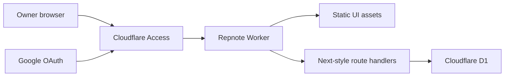
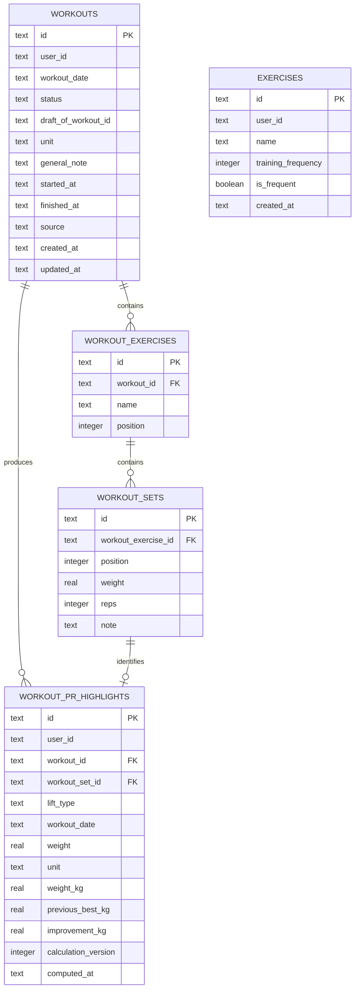

# Repnote Technical Guide

This document describes the implementation of Repnote for developers who need to understand, maintain, or extend the codebase. For a clean Cloudflare installation, use [DEPLOYMENT.md](./DEPLOYMENT.md). For the product overview and local commands, use [README.md](./README.md).

## 1. System overview

Repnote is a single-owner, self-hosted workout journal. The open-source edition contains two primary application areas:

- **Workouts**: workout history, calendar/list browsing, filtering, exercise management, workout creation, D1-backed draft autosave, editing, deletion, exercise frequency, and true one-rep-max PR highlights.
- **RM Calculator**: a client-side 1–15 RM reference calculator using NSCA percentages, Brzycki, and Epley.

The application is deployed as one Cloudflare Worker with static assets and one D1 database. Cloudflare Access protects the entire application hostname and delegates sign-in to Google.



There is no separate origin server, auth database, Google API integration, public workout API, guest mode, service-token flow, or CLI API.

## 2. Technology stack

| Layer | Technology | Responsibility |
| --- | --- | --- |
| UI | React 19 | Interactive workout editor, history, exercise library, and calculator |
| Application structure | Next.js App Router syntax | Layout, pages, metadata, and route handlers |
| Cloudflare build adapter | vinext + Vite | Converts the Next-style application into a Worker and static asset bundle |
| Runtime | Cloudflare Workers | Serves UI assets and executes API handlers |
| Database | Cloudflare D1 / SQLite | Authoritative workouts, drafts, exercise library, and PR events |
| ORM/schema tooling | Drizzle ORM + Drizzle Kit | TypeScript schema and SQL migration generation |
| Authentication | Cloudflare Access + Google OAuth | Restricts the complete application to one configured Gmail address |
| Icons | Lucide React | Consistent UI iconography |
| Styling | Global CSS | Responsive application styling without a component framework |
| Tests | Node test runner | Build-time repository invariants and sanitization checks |

The minimum supported Node.js version is `22.13.0`.

## 3. Repository layout

```text
app/
  api/
    draft/route.ts       D1 draft read, autosave, and discard
    exercises/route.ts   Exercise library read and mutation
    workouts/route.ts    Completed workout read, write, edit, and delete
  rm/
    RmCalculator.tsx     Client-side RM calculator
    page.tsx             Standalone calculator route
  CustomSelect.tsx       Project-styled select component
  globals.css            Complete visual system and responsive rules
  layout.tsx             Root HTML layout and dynamic metadata
  page.tsx               Main application and client-side interaction model
db/
  d1.ts                  Cloudflare D1 binding accessor
  schema.ts              Drizzle table definitions
drizzle/
  0000...0004.sql        Ordered database migrations and exercise seed
  meta/                   Drizzle migration journal and schema snapshots
lib/
  owner-auth.ts           Server-side owner authorization
  repnote-data.ts         D1 read model and response assembly
  workout-write.ts        Workout normalization and D1 write statements
  pr-highlights.ts        True 1RM PR timeline rebuild
  rm-calculator.ts        Shared RM formulas and lookup values
tests/
  open-source.test.mjs    Build and open-source invariant tests
DEPLOYMENT.md             End-to-end Cloudflare and Google setup guide
wrangler.jsonc            Worker, route, D1 binding, and runtime variables
vite.config.ts            vinext/Cloudflare build configuration and build metadata
```

## 4. Runtime and rendering model

`app/layout.tsx` provides the root document and dynamically creates canonical Open Graph metadata from the incoming host. `app/page.tsx` is a client component containing the main interactive application. `/rm` also exposes the calculator as a standalone page, while the main app embeds the same calculator component in its RM tab.

The production build has two user-facing pages and three API route groups:

```text
GET  /
GET  /rm
*    /api/workouts
*    /api/draft
*    /api/exercises
```

Static assets are emitted to `dist/client`. The Worker entry is emitted to `dist/server/index.js`. Wrangler binds the static directory as `ASSETS` and D1 as `DB`.

`vite.config.ts` injects two build-time constants:

- `__APP_VERSION__`: read from `package.json`.
- `__APP_BUILD_TIME__`: generated as an ISO timestamp when the build starts.

The favicon dropdown currently displays the build time. These constants are compile-time metadata and are not stored in D1.

## 5. Authentication and authorization

Authentication has two layers.

### 5.1 Cloudflare Access boundary

Cloudflare Access protects the complete custom hostname. Google OAuth runs between the browser, Google, and Cloudflare Access. Repnote never receives a Google access token and never requests Gmail, Drive, Calendar, or other Google data.

The Access policy must allow only the exact owner email. Unauthenticated requests are rejected or redirected before they reach normal application handling.

### 5.2 Worker owner check

Every API handler calls `isOwnerRequest(request)` from `lib/owner-auth.ts`. A production request is authorized only when both conditions are true:

1. The URL hostname equals `OWNER_HOST`, case-insensitively.
2. `cf-access-authenticated-user-email` equals `OWNER_EMAIL`, case-insensitively.

This hostname check also prevents a valid-looking email header from authorizing requests sent to an unintended Worker hostname.

Local development may set `DEV_AUTH_BYPASS=true`, but the bypass is accepted only when the request hostname is exactly `localhost` or `127.0.0.1`. A deployed hostname cannot use this bypass.

Failed application authorization returns:

```json
{
  "error": "Owner authentication required"
}
```

with HTTP status `403`. Cloudflare Access may instead return its own login redirect before the Worker executes.

## 6. Configuration contract

Repnote reads these non-secret Worker variables from `wrangler.jsonc`:

| Variable | Purpose |
| --- | --- |
| `OWNER_EMAIL` | Exact email authorized by the Worker |
| `OWNER_HOST` | Exact production hostname, without protocol or path |
| `DEV_AUTH_BYPASS` | Localhost-only development convenience; must be `false` in production |

The database binding must remain named `DB`. `db/d1.ts` accesses `env.DB` directly and throws if the binding is unavailable.

Google OAuth Client Secrets and Cloudflare credentials are deliberately absent from the application configuration. The OAuth secret belongs in Cloudflare's identity-provider configuration.

## 7. Data model

Repnote currently uses a fixed logical user ID, `owner`. The schema includes `user_id` for ownership and query isolation, but the application is not a multi-user product.



### 7.1 `workouts`

One row represents either a draft or a completed workout.

- `status` is `draft` or `completed`.
- `draft_of_workout_id` points to the completed record being edited; it is not a foreign key and is cleared on completed records.
- `workout_date` is the logical local calendar date in `YYYY-MM-DD` form.
- `started_at` and `finished_at` are nullable ISO timestamps. Imported historical records may legitimately have neither.
- `unit` applies to every weighted set in the workout and is `kg` or `lbs`.

### 7.2 `workout_exercises` and `workout_sets`

These tables store the ordered contents of a workout. `position` is the canonical display order. Cascading foreign keys remove child rows when a parent workout or workout exercise is deleted.

A workout exercise stores its name as a historical snapshot; it does not reference the exercise-library ID. This prevents later library changes from silently rewriting past records, but it means frequency and PR logic depend on canonical exercise names.

Weights and reps are nullable so partially completed draft rows can be persisted. Empty or non-numeric input values are normalized to SQL `NULL` by `cleanNumber`.

### 7.3 `exercises`

This is the reusable exercise library.

- `id` is stable within the library.
- `training_frequency` is derived from completed workouts.
- `is_frequent` controls which exercises appear in the quick-add area.
- Results are sorted by frequency descending and then name ascending.

The seed migration inserts 49 exercise names, zero workout history, and five frequent exercises.

### 7.4 `workout_pr_highlights`

This is a derived, persisted event timeline, not a manually edited table. Each row identifies a workout set that established a new true one-rep-max PR for Bench Press, Squat, or Deadlift.

The row keeps both the original weight/unit and normalized kilograms. `calculation_version` allows future PR algorithms to be distinguished.

## 8. Application data shape

The browser and APIs exchange nested workout objects:

```json
{
  "id": "workout-id",
  "status": "completed",
  "draftOfWorkoutId": null,
  "date": "2026-08-22",
  "startedAt": "2026-08-23T00:12:00.000Z",
  "finishedAt": "2026-08-23T01:42:00.000Z",
  "unit": "lbs",
  "note": "General workout note",
  "source": "manual",
  "prHighlights": [],
  "exercises": [
    {
      "id": "workout-exercise-id",
      "name": "Squat",
      "sets": [
        {
          "id": "set-id",
          "weight": "315",
          "reps": "5",
          "note": "Strong set"
        }
      ]
    }
  ]
}
```

The read model intentionally serializes weight and reps as strings because the same shape feeds editable form controls. Empty database values become empty strings.

## 9. API surface

All endpoints are private browser APIs and require the owner check. There is no public or CLI contract.

### 9.1 Workouts

#### `GET /api/workouts`

Returns completed workouts in descending date order. Exercises, sets, and persisted PR highlights are assembled into nested objects.

```json
{ "workouts": [] }
```

#### `POST /api/workouts`

Creates a completed workout or replaces an existing completed workout with the same ID. When completing a separate draft, `draftId` identifies the draft row to remove.

Required top-level fields are `id` and an `exercises` array. On success:

```json
{ "ok": true, "workout": {} }
```

The write, optional draft removal, exercise-frequency recalculation, and full PR rebuild are submitted in one D1 batch.

#### `DELETE /api/workouts?id=<workout-id>`

Deletes the workout and children, then recalculates exercise frequency and rebuilds PR history.

### 9.2 Draft

#### `GET /api/draft`

Returns the most recently updated draft or `null`:

```json
{ "draft": null }
```

#### `PUT /api/draft`

Upserts one draft and its complete nested exercise/set content. Repnote supports one active draft for the owner: saving a draft deletes any other draft rows before upserting the supplied one. A draft cannot overwrite an ID already used by a completed workout; that conflict returns HTTP `409`.

#### `DELETE /api/draft?id=<draft-id>`

Explicitly discards the specified draft and its child rows.

Draft writes do not recalculate exercise frequency or PR history.

### 9.3 Exercises

#### `GET /api/exercises`

Returns the exercise library as `{ id, name, frequency, isFrequent }` items.

#### `POST /api/exercises`

Adds an exercise. The client may provide an ID; otherwise the server generates a UUID. The current conflict rule is based on ID, not name.

#### `PATCH /api/exercises`

Updates `isFrequent` for one exercise.

#### `DELETE /api/exercises?id=<exercise-id>`

A legacy administrative endpoint exists, although the current UI does not expose exercise deletion.

## 10. Workout write lifecycle

### 10.1 Creating a draft

The browser creates an ID, sets the current local calendar date, records `startedAt`, defaults the unit to `lbs`, and opens the workout editor.

### 10.2 Autosave

Once initial data loading is complete, draft edits trigger a 500 ms debounced `PUT /api/draft`. Saves are serialized through a promise chain so an older request cannot be intentionally launched after a newer queued snapshot.

Additional reliability behavior includes:

- failed saves set an error state and keep the draft in the editor;
- a retry runs when the browser returns online;
- failed saves are retried periodically while the page remains open;
- a best-effort request with `keepalive: true` runs during page exit;
- legacy local-storage drafts are read once for migration, then removed after a successful D1 save.

D1 is the authoritative draft store. Local storage is not used to persist new drafts.

### 10.3 Completing a workout

The UI does not clear the editor merely because the request was sent. It waits for `POST /api/workouts` to succeed and uses the workout returned by the server. If the network or server fails, the editor remains open and the D1 draft remains recoverable.

Completion performs these logical operations together:

1. Delete the separate draft row and children when `draftId` differs from the final workout ID.
2. Upsert the completed workout.
3. Replace its ordered exercises and sets.
4. Recalculate every exercise frequency.
5. Rebuild the complete Big Three PR event timeline.

### 10.4 Editing a completed workout

Editing creates a draft whose `draft_of_workout_id` points to the original completed workout. The UI preserves the original `startedAt`. On successful save, it writes to the original workout ID, updates `finishedAt`, removes the editing draft, and rebuilds all derived data.

### 10.5 Deleting a workout

Deletion removes the selected workout content and top-level row, then performs the same full frequency and PR recalculations. This is necessary because deleting or backdating an old workout can change every later PR event.

## 11. Derived exercise frequency

`training_frequency` is not a set count. It is calculated as:

```sql
COUNT(DISTINCT workout_date)
```

for completed workouts containing the exact exercise name. If an exercise appears multiple times or has many sets on the same calendar date, that date contributes one occurrence.

Drafts never contribute to frequency. The update covers the entire owner's exercise library after every completed-workout create, edit, or delete.

## 12. True 1RM PR calculation

PR highlights are generated in `lib/pr-highlights.ts` with a D1 SQL window-query pipeline.

Eligibility is deliberately strict:

- the workout is completed;
- the exercise name is exactly `Bench Press`, `Squat`, or `Deadlift`;
- reps equal exactly `1`;
- weight is positive.

For each workout and lift, only the heaviest eligible single is considered. Pounds are normalized with:

```text
weightKg = weightLbs / 2.2046226218
```

Workouts are ordered by workout date, then the first available timestamp, then workout ID. A row is a PR event only when its normalized weight strictly exceeds the previous historical maximum. Equal weights do not create new PRs.

The first eligible single for a lift is stored as the baseline PR with `previous_best_kg = null`. All later events include the previous best and improvement.

The entire derived table is rebuilt after every completed-workout mutation. This favors correctness for historical imports, edits, and deletion over incremental complexity.

## 13. RM Calculator

The calculator runs entirely in the browser and does not call an API or write D1 data. `lib/rm-calculator.ts` is shared calculation code.

Supported inputs are positive weight and an integer rep count from 1 through 15.

### 13.1 NSCA lookup

The lookup estimates 1RM by dividing entered weight by the percentage associated with the entered reps. Published anchor values are used where available. Values for 11RM, 13RM, and 14RM are interpolated between retained anchors.

### 13.2 Brzycki

```text
1RM = weight × 36 / (37 - reps)
```

### 13.3 Epley

```text
1RM = weight × (1 + reps / 30)
```

For a real one-rep input, all methods return the entered weight directly.

The reference table projects each estimated 1RM back to 1–15 RM working weights. For each row, the lowest displayed estimate receives the safe-low treatment and the highest receives the danger-high treatment. If all displayed values are equal, neither extreme is highlighted.

`estimateEquivalentOneRm` returns the median of the NSCA, Brzycki, and Epley 1RM estimates. It is available for features that need one robust equivalent-1RM value, although the open-source edition does not include the Insights chart.

## 14. Frontend state and interaction model

The main application is intentionally implemented in one client component so its overlays can preserve list state without route remounts.

Important state groups include:

- active primary tab (`history`, `today`, or `rm` internally);
- completed workout history;
- active draft and editing target;
- list/calendar mode, filters, and collapsed months;
- selected workout detail;
- exercise library and frequent-exercise preferences;
- save, error, and menu state.

Although `today` remains an internal state name, it represents the New/Edit Workout overlay rather than a third bottom navigation tab.

### 14.1 Overlay navigation

New Workout, Workout Detail, and Exercise Library are page-like overlays. Opening one uses `History.prototype.pushState`; closing it uses an in-app state transition and history-state cleanup rather than a page reload. A `popstate` handler maps browser back navigation to closing the active overlay.

The New Workout and Exercise Library overlays also implement left-edge touch gestures. The gestures require a rightward horizontal movement that dominates vertical movement before they close the overlay. This avoids handing the gesture to the browser's previous-document history in normal use.

### 14.2 Swipe actions

Workout rows, draft exercises, and draft sets use custom pointer-driven horizontal swipe containers. They claim pointer capture only after horizontal movement clearly exceeds vertical movement. Deletion appears as text rather than a permanent icon, keeping the default layout compact.

### 14.3 Browser cache

Completed history and the exercise library are cached in local storage to provide immediate fallback content during startup. The app then fetches authoritative D1 data and replaces the cache when successful.

This cache is not the primary database. Workout completion is not considered successful until the server confirms it, and active drafts are persisted in D1.

## 15. Database migrations

Migrations are append-only and applied in numeric order:

| Migration | Change |
| --- | --- |
| `0000` | Core workouts, workout exercises, workout sets, and exercise library |
| `0001` | Exercise frequency and frequent flag |
| `0002` | Persisted Big Three PR highlights and initial backfill |
| `0003` | Draft/completed status and edit-draft linkage |
| `0004` | Sanitized 49-exercise seed |

After modifying `db/schema.ts`, run:

```bash
pnpm db:generate
```

Review generated SQL before applying it. Test locally, then apply remote migrations before deploying code that depends on the new schema. Worker rollback does not roll back D1.

## 16. Build and deployment pipeline

The important commands are:

```bash
pnpm dev
pnpm build
pnpm test
pnpm lint
pnpm db:generate
pnpm db:migrate:remote
pnpm deploy:cloudflare
```

`pnpm deploy:cloudflare` builds with vinext and deploys through Wrangler. `wrangler.jsonc` defines:

- Worker entry and compatibility settings;
- static asset directory;
- custom domain;
- D1 binding and migration directory;
- owner authorization variables;
- Cloudflare observability.

The checked-in Wrangler file contains placeholders and must not be deployed unchanged.

## 17. Testing strategy

`pnpm test` performs a production build and then runs Node tests. The current tests focus on architectural and release invariants:

- only Workouts and RM are primary tabs;
- Guest, CLI, docs, and `/v1` route trees are absent;
- every API route performs owner authorization;
- the D1 binding and production auth defaults are correct;
- the seed contains 49 sanitized exercises and no workout records;
- drafts live in D1 and derived calculations read completed workouts only;
- deployment documentation contains the required handoff steps;
- obvious embedded credentials are absent.

`pnpm lint` runs ESLint separately. For higher-risk changes, add behavior tests around extracted pure logic and perform the production verification sequence in `DEPLOYMENT.md`.

## 18. Important invariants for future changes

Maintain these properties unless the product architecture is intentionally redesigned:

1. D1 remains authoritative for workouts and drafts.
2. All API routes remain behind both Cloudflare Access and the Worker owner check.
3. `DEV_AUTH_BYPASS` never authorizes a non-local hostname.
4. Completed-history queries, frequency, and PR calculations exclude drafts.
5. A failed finish request never clears the editable draft.
6. Workout mutations recalculate frequency and PR data atomically with the primary write.
7. Imported records without real timestamps keep `startedAt` and `finishedAt` as `null`.
8. The unit applies consistently to every weighted set in a workout.
9. Exercise names used by PR logic remain canonical.
10. Secrets never enter source, documentation, logs, or checked-in environment files.

## 19. Current architectural boundaries

These are intentional limitations of the open-source release, not undocumented capabilities:

- **Single owner**: the fixed `owner` user ID is not a complete multi-user tenancy system.
- **One active draft**: saving a new draft removes other draft rows for the owner.
- **Name-based historical linkage**: workout exercises snapshot a name instead of referencing an exercise-library row.
- **Name-based derived logic**: exercise frequency and Big Three PR recognition require exact canonical names.
- **Whole-history rebuilds**: frequency and PR correctness is prioritized over incremental performance.
- **Browser-oriented API**: there is no stable external API versioning or non-interactive authentication flow.
- **Optimistic exercise preferences**: the UI updates some exercise-library state immediately and displays an error/reverts where implemented if persistence fails.

Anyone adding multi-user support, exercise renaming, large-scale datasets, or external API access should redesign these boundaries explicitly rather than assuming the current schema already supports them.
